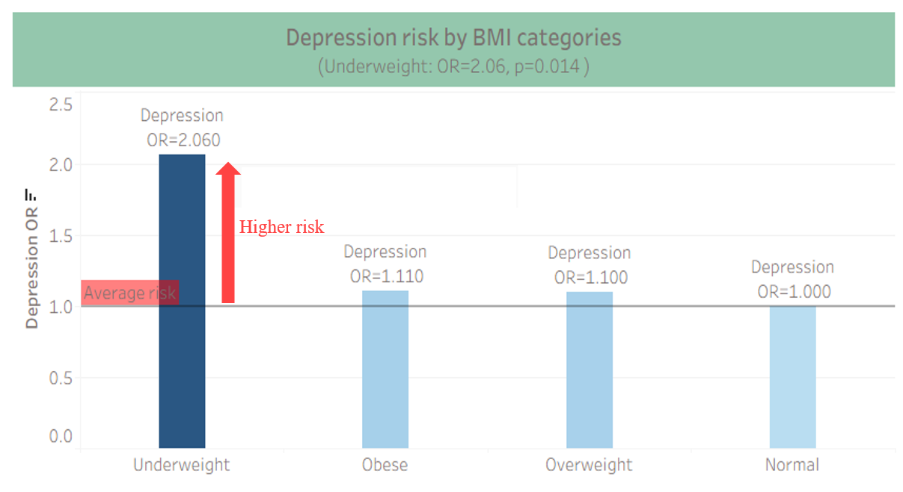

# Final Results

This section presents the key findings from the Multivariate analysis of the mental wellbeing and physical activity dataset. The figures summarize participant demographics, physical activity levels, and the association of various risk factors with depression. All figures were enhanced for clarity and aesthetics using Tableau.

## Figure 1: Participant Profile
5,583 participants: 3,700 females, 1,883 males. Age 18–60 (mean 55). Activity levels: high 46%, moderate 37%, low 16%.

## Figure 2: Gender Interaction with Physical Activity
Males with high activity had a **62% lower risk** of depression (OR = 0.38), and males with moderate activity had a **56% lower risk** (OR = 0.44). For females, however, both high activity (OR = 1.06) and moderate activity (OR = 1.13) showed **no significant association** with depression.  

**Key takeaway:** Physical activity appears protective for males but shows no significant effect for females.

## Figure 3: Likelihood of Depression by Risk Factors
Shows depression odds by key factors: **Older age** is protective (OR = 0.97). **Very low income:** OR = 1.95. **Underweight (BMI):** OR = 2.06. **Chronic disease:** OR = 3.72, **are the most significant risk factors with chronic disease being the highest risk factor**.

**Key takeaway:** Chronic disease, underweight status, and very low income are the strongest risk factors for depression, while older age provides some protection.

## Figure 4: Depression Risk Across BMI Categories
Shows how depression risk varies by BMI. **Underweight:** OR = 2.06 (highest risk). **Overweight/Obese:** OR ≈ 1.1 (no association found with depression). **Normal weight:** OR = 1 (reference).

**Key takeaway:** Underweight individuals face the highest depression risk, while overweight and obese categories show only a slight increase compared to normal weight.

## Figure 5: Depression Risk by Income Level
Shows how depression risk varies by income group. **Very low income:** OR = 1.95 (highest risk). **Low income**: OR = 1.44 (no association found with depression). **Middle income**: OR = 1.11 (no association found with depression). **High income**: OR = 1 (reference). **Very high income**: OR = 1.75 (protective).

**Key takeaway**: Lower income levels are consistently associated with higher depression risk, highlighting the socioeconomic gradient in mental health.

## Figure 6: Depression Risk by Activity Level
Individuals with **high activity** show a 38% lower odds of depression (OR = 0.62), while those with **moderate activity** show a 33% lower odds (OR = 0.67), compared to the **low activity** group (OR = 1, reference).

**Key takeaway:** Physical activity reduces, but does not fully offset—the impact of chronic disease and low income on depression risk.

## Figure 7: Activity Level and Other Risk Factors

Among **high activity** individuals:

**Chronic disease** (OR = 2.10), **low income** (OR = 1.30), and **obesity** (OR = 0.85).

Physical activity showed a slight improvement in depression risk, but the effects were not statistically significant.

Among low activity individuals:

**Chronic disease** (OR = 3.72), **low income** (OR = 1.95), and **obesity** (OR = 1.11).

Depression risk was substantially higher compared to their high-activity counterparts.

**Key takeaway:** Physical activity may help reduce depression risk across vulnerable groups, but it does not fully counteract the negative effects of chronic disease or low income.

## Figure 8: Probability of Depression by Age Group
This line plot shows how the predicted probability of depression changes with age. The risk is **highest among young adults** (around age 20–30), then steadily declines through middle age (31–60), and **continues to fall** in older age groups. **By age 71 and above**, the probability reaches its **lowest level** (around 0.1).

**Key takeaway**: Depression risk decreases progressively with age, with young adults facing the greatest vulnerability.

