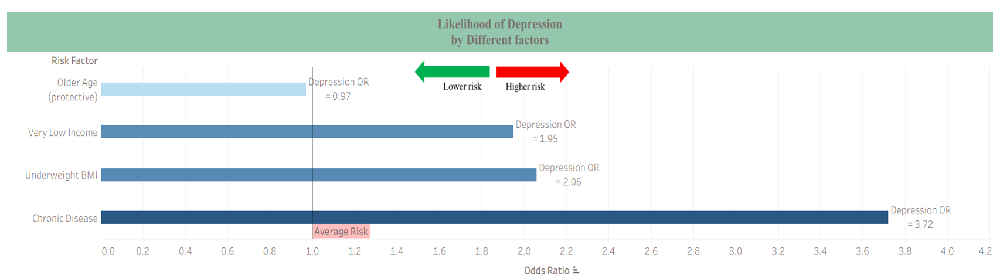

# Final Results

This section presents the key findings from the analysis of the mental wellbeing and physical activity dataset. The figures summarize participant demographics, physical activity levels, and the association of various risk factors with depression. All figures were enhanced for clarity and aesthetics using Tableau.

## Figure 1: Participant Profile
Description:
5,583 participants: 3,700 females, 1,883 males. Age 18–60 (mean 55). Activity levels: high 46%, moderate 37%, low 16%.

## Figure 2: Gender Interaction with Physical Activity

Description:
Shows the association between physical activity and depression by gender. Males with high activity have 38% lower odds of depression, and moderate activity reduces odds by 44%. Females show no significant association: high activity OR = 1.06, moderate activity OR = 1.13.

## Figure 3: Age-Specific Effects: Moderate Activity and Depression Risk

Description:
Shows the effect of moderate activity on depression risk in males by age group. Ages 18–39: 68% lower risk. Ages 40–59: 33% lower risk. Ages 60+: no significant association.

## Figure 4: Likelihood of Depression by Risk Factors

Description:
Shows depression odds by key factors: Older age is protective (OR = 0.97). Very low income: OR = 1.95. Underweight (BMI): OR = 2.06. Chronic disease: OR = 3.72, the highest risk factor.

## Figure 5: Depression Risk Across BMI Categories
Description:
Shows how depression risk varies by BMI. Underweight: OR = 2.06 (highest risk). Overweight/Obese: OR ≈ 1.1. Normal weight: OR = 1 (reference).

## Figure 6: Depression Risk by Income Level
Description:
Shows how depression risk varies by income group. Very low income: OR = 1.95 (highest risk). Low income: OR = 1.44. Middle income: OR = 1.11. High income: OR = 1 (reference). Very high income: OR = 1.75.

## Figure 7: Depression Risk by Activity Level
Individuals with high activity show a 38% lower odds of depression (OR = 0.62), while those with moderate activity show a 33% lower odds (OR = 0.67), compared to the low activity group (OR = 1, reference).

## Figure: Activity Level and Other Risk Factors

Among high activity individuals:

Chronic disease (OR = 2.10), low income (OR = 1.30), and obesity (OR = 0.85).

Physical activity showed a slight improvement in depression risk, but the effects were not statistically significant.

Among low activity individuals:

Chronic disease (OR = 3.72), low income (OR = 1.95), and obesity (OR = 1.11).

Depression risk was substantially higher compared to their high-activity counterparts.

Key takeaway: Physical activity may help reduce depression risk across vulnerable groups, but it does not fully counteract the negative effects of chronic disease or low income.

